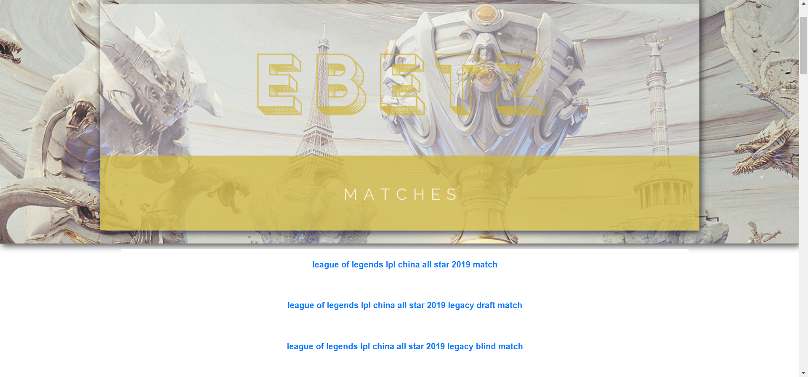

<!-- PROJECT LOGO -->
<br />
<p align="center">
  <a>
    
  </a>
</p>

<!-- TABLE OF CONTENTS -->
## Table of Contents

* [About the Project](#about-the-project)
  * [Built With](#built-with)
* [Getting Started](#getting-started)
  * [Prerequisites](#prerequisites)
  * [Installation](#installation)
* [Usage](#usage)
* [Contributers](#contributers)
* [Contact](#contact)

<!-- ABOUT THE PROJECT -->
## About The Project



E-Betz is a application which is used to bet on live matches for video game tournaments.
A user is able to sign up with an account and will start with 10,000 credits.
Once signed in a user can find live matches and bet on teams that are going to play.

[Deployed project](https://ebetz.herokuapp.com/home)


### Built With
* [Bootstrap](https://getbootstrap.com)
* [Javascript](https://www.javascript.com/)
* [ReactJS](https://reactjs.org/)
* [Passport Google Strategy](http://www.passportjs.org/docs/google/)
* [Express](https://expressjs.com/)
* [MongoDB](https://www.mongodb.com/)
* [Node](https://nodejs.org/en/)
* [Pandascore API](https://pandascore.co/)

<!-- GETTING STARTED -->
## Getting Started

### Prerequisites

Have Visual Studio Code installed or similar application

### Installation

In your favorite terminal do the following:

1. Clone the repo
```sh
git clone https://github.com/adrianctwo/bet.git
```
2. Install NPM packages
```sh
npm install
```

<!-- USAGE EXAMPLES -->
## Usage

1. ***A user will be instructed to sign in, if a user doesn't have a log in they can created a account by clicking the sign up button.***

2. ***Once logged in a user will be redirected to the Tournament list page***

3. ***On the tournament page a user can do the following:***
    1. **Click a tournament**
        1. This will route you to the matches page

4. ***On the Matches page a user can do the following:***
    1. **Clicking a match**
        1. Once a match is click it will take the user to the match page which will show the teams playing each other with their roster.
        2. A user will be able to bet by clicking the bet now button
            1. A modal will pop up and the user will type how much they want to bet then click the submit button

<!-- CONTRIBUTERS -->
## Contributers

Adrian Situ - ReactJS, Pandascore API, User Interface

Angelo DePaolo - User Interface

Jared Cabanilla - Pandscore API & User Interface

Rachel Gundy - Authentication & User Interface


